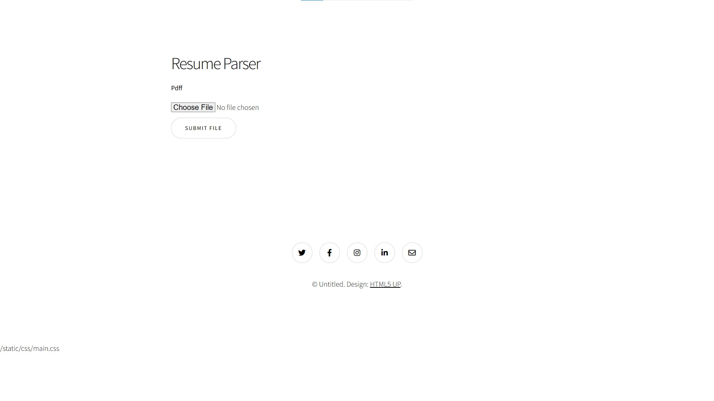
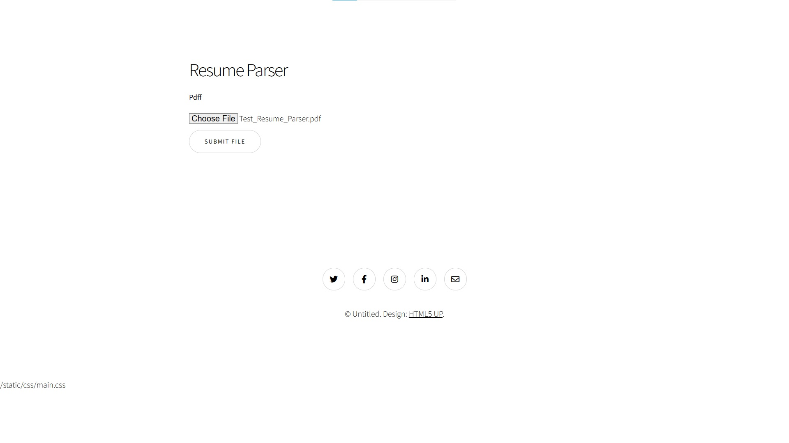
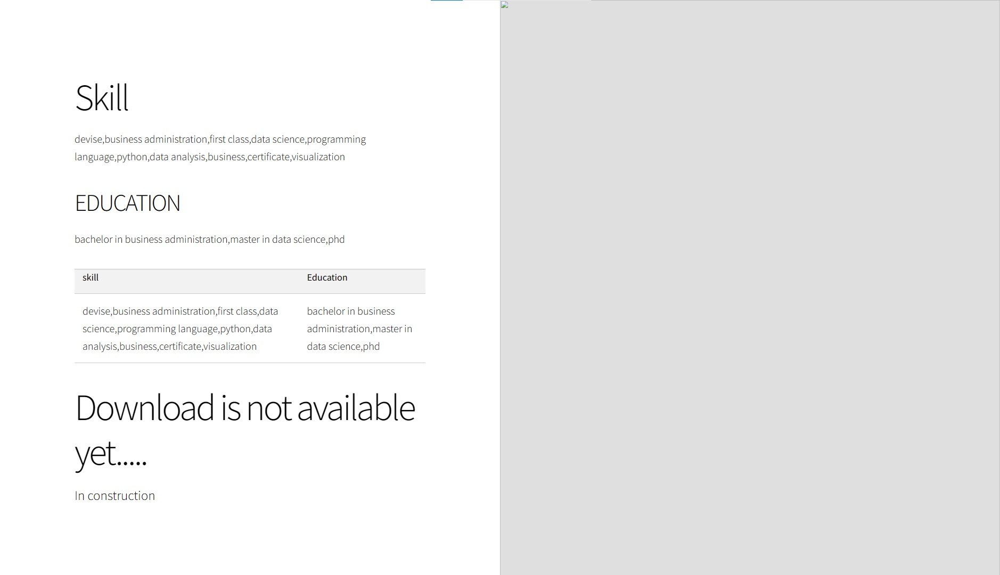

Here is the look is the website for resume parser.

### Usage
- Create empty folder name "instance" in the same directory as main.py
- Run the local website by using below command

```
python -m spacy download en_core_web_sm
export FLASK_APP=main
flask run
```

### Note
- The simple backend is inside a file named "data_extrator.py".
- The "Resume_Parsing.ipynb" contains the train of thought, function testing and explaining 
how everything works in the form of jupyter notebook. This obtained and modified 
from Dr.Chaklam Silsuwanpachai during the "Natural Language Understanding" class.
- Websites template copy from my genius friend [Ati](https://github.com/AtiChetsurakul).


This is Homepage.


You can click the button for uploading.


Here is the results.


